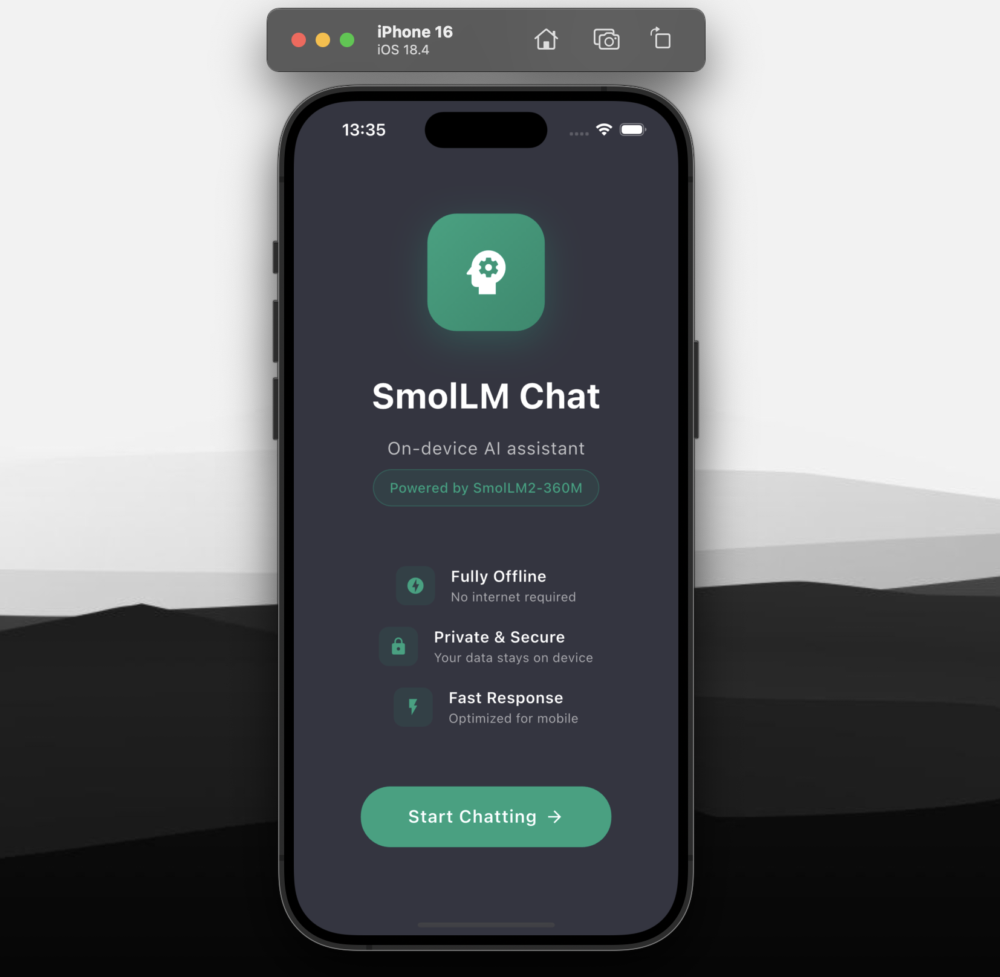
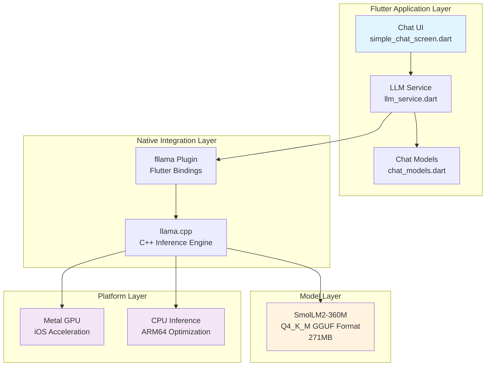
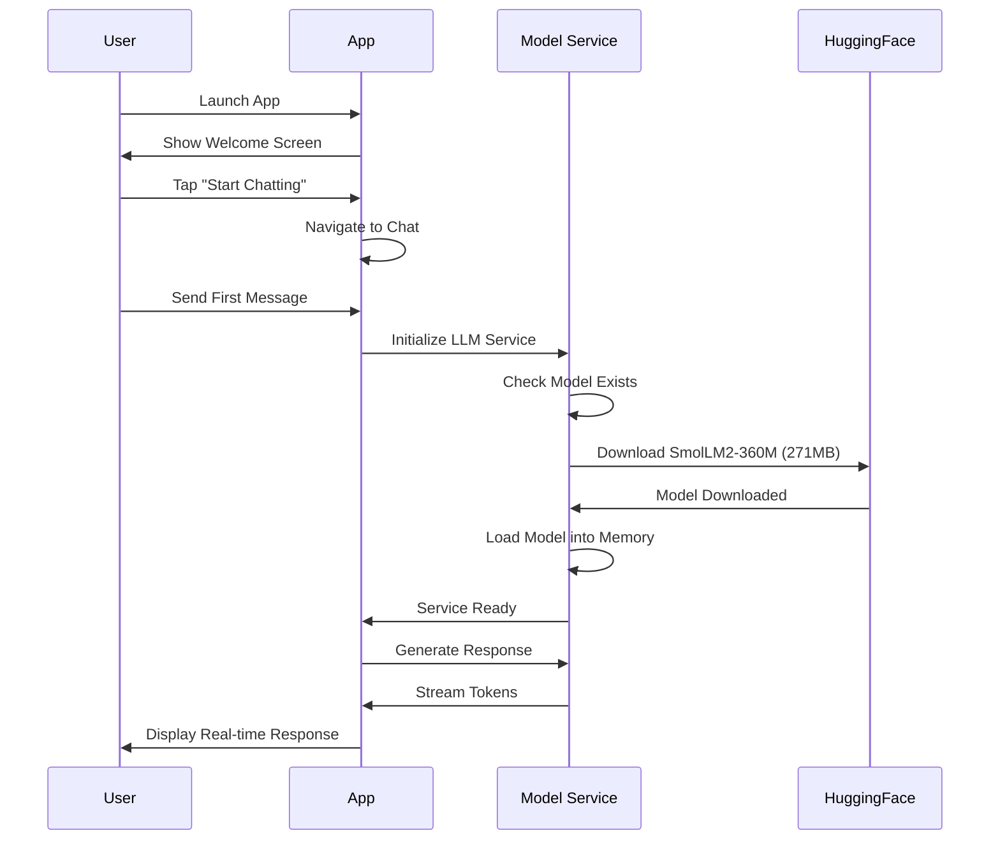
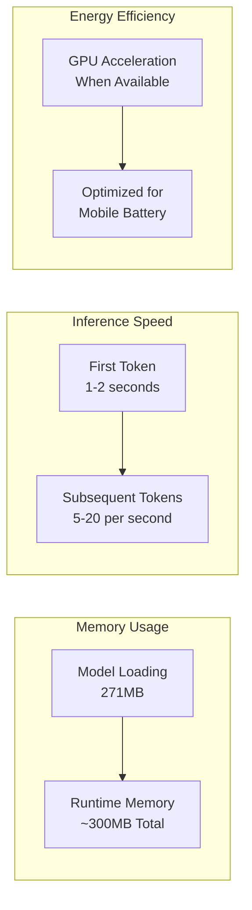

# SmolLM Flutter Research Project

[](https://flutter.dev)
[](https://dart.dev)
[](https://developer.apple.com/ios/)
[](https://github.com)
[](LICENSE)

<div align="center">
  
</div>

> A research project demonstrating on-device Large Language Model inference in mobile applications using SmolLM2-360M and Flutter

## Overview

This project explores the feasibility and implementation of running Large Language Models (LLMs) natively on mobile devices without requiring internet connectivity. Using the lightweight **SmolLM2-360M** model with **Flutter** and **fllama** bindings, we achieve real-time AI chat capabilities entirely on-device.

### Research Objectives

- **Privacy-First AI**: Demonstrate fully offline LLM inference on mobile devices
- **Performance Analysis**: Measure inference speed, memory usage, and battery consumption
- **Technical Feasibility**: Validate cross-platform deployment of quantized models
- **User Experience**: Design intuitive interfaces for on-device AI interactions

## Architecture



## Technical Specifications

### Model Details
- **Architecture**: SmolLM2-360M (360 million parameters)
- **Quantization**: Q4_K_M (4-bit quantization)
- **File Size**: 271MB
- **Context Window**: 2,048 tokens
- **Source Repository**: [bartowski/SmolLM2-360M-Instruct-GGUF](https://huggingface.co/bartowski/SmolLM2-360M-Instruct-GGUF)¹

### Performance Metrics

<div align="center">

| Device | Tokens/Second | Memory Usage | First Load Time |
|--------|---------------|--------------|-----------------|
| iPhone 15 Pro | 15-20 | ~300MB | ~2-3 seconds |
| iPhone 13 | 10-15 | ~300MB | ~3-4 seconds |
| iOS Simulator | 5-10 | ~300MB | ~5-8 seconds |

</div>

### Platform Support
- **iOS**: 14.0+ (Production Ready)
- **Android**: Configured (Requires Testing)
- **Web**: Configured (Requires WASM)

## Dependencies

### Core Framework
- **Flutter SDK**: 3.7.2+
- **fllama**: [Telosnex/fllama](https://github.com/Telosnex/fllama)² (Flutter bindings for llama.cpp)
- **llama.cpp**: C++ inference engine³

### Flutter Packages
```yaml
dependencies:
  fllama:
    git:
      url: https://github.com/Telosnex/fllama.git
      ref: main
  path_provider: ^2.1.1
  http: ^1.1.0
```

## Installation

### Prerequisites
```bash
# Verify Flutter installation
flutter --version  # Requires 3.7.2+

# iOS development (macOS only)
pod --version
xcode-select --install
```

### Setup Instructions

1. **Clone the repository**
   ```bash
   git clone <repository-url>
   cd smollm_flutter
   ```

2. **Install dependencies**
   ```bash
   flutter pub get
   ```

3. **iOS setup** (Required for iOS development)
   ```bash
   cd ios
   pod install
   cd ..
   ```

4. **Download model** (Optional - happens automatically on first run)
   ```bash
   ./download_model.sh
   ```

5. **Run the application**
   ```bash
   flutter run
   ```

## Usage

### Live Demo

<div align="center">
  <a href="https://youtu.be/uYtQDjZNp_Y" target="_blank">
    
  </a>
  <p><em>🎥 <strong><a href="https://youtu.be/uYtQDjZNp_Y">Watch Demo</a></strong> - Real-time demonstration of on-device SmolLM2-360M inference with streaming responses</em></p>
</div>

### First Launch Behavior


### Chat Interface Features
- **Streaming Responses**: Token-by-token generation
- **Conversation History**: Persistent chat context
- **Error Handling**: Network and model failure recovery
- **Loading States**: Download progress and initialization feedback

## Research Findings

### Key Achievements

<div align="center">

| Achievement | Status | Details |
|-------------|---------|---------|
| **Integration** | ✅ | Working fllama + SmolLM2-360M integration |
| **Real-time Inference** | ✅ | Streaming token generation on mobile hardware |
| **Performance** | ✅ | 4-bit quantization maintains quality while reducing size |
| **Production Ready** | ✅ | Complete error handling and user experience |

</div>  

### Technical Challenges Resolved

1. **Framework Integration Issues**
   - Resolved phantom `SmolLM.framework` references in Xcode project
   - Fixed callback type mismatches in fllama API

2. **Model Distribution Problems**
   - Corrected HuggingFace repository and file naming conventions
   - Implemented robust model download and verification

3. **Performance Optimization**
   - Configured optimal inference parameters for mobile constraints
   - Implemented GPU acceleration where available

### Performance Analysis



## Project Structure

```
smollm_flutter/
├── lib/
│   ├── main.dart                    # Application entry point
│   ├── simple_chat_screen.dart      # Chat interface with streaming
│   ├── services/
│   │   └── llm_service.dart        # Core LLM inference service
│   └── models/
│       └── chat_models.dart        # Data models and conversation management
├── ios/
│   ├── Podfile                     # iOS dependencies and configuration
│   └── Runner/
│       └── Info.plist              # iOS app configuration
├── assets/
│   └── models/                     # Local model storage
├── download_model.sh               # Model download automation
└── pubspec.yaml                    # Flutter dependencies
```

## Future Research Directions

### Technical Enhancements
- **Model Variants**: Testing larger models (SmolLM2-1.7B) on high-end devices
- **Quantization Studies**: Comparing Q4_K_M vs Q5_K_M vs Q8_0 performance
- **Multi-platform Validation**: Android and Web deployment testing
- **Context Management**: Implementing conversation memory optimization

### Performance Optimization
- **Device-Specific Tuning**: Adaptive parameters based on hardware capabilities
- **Battery Impact Analysis**: Long-term usage studies
- **Model Caching Strategies**: Reducing initialization time

### User Experience Research
- **Interface Design**: Optimal mobile AI interaction patterns
- **Accessibility**: Voice input and screen reader compatibility
- **Privacy Features**: Local conversation export and deletion

## Citations and References

1. **SmolLM2 Model**: Allal, Loubna Ben, et al. "SmolLM2 - A Family of Small Language Models." *Hugging Face Model Hub*, 2024. [bartowski/SmolLM2-360M-Instruct-GGUF](https://huggingface.co/bartowski/SmolLM2-360M-Instruct-GGUF)

2. **fllama Flutter Plugin**: Telosnex. "fllama - Flutter bindings for llama.cpp." *GitHub*, 2024. [github.com/Telosnex/fllama](https://github.com/Telosnex/fllama)

3. **llama.cpp Inference Engine**: Gerganov, Georgi. "llama.cpp - Port of Facebook's LLaMA model in C/C++." *GitHub*, 2024. [github.com/ggerganov/llama.cpp](https://github.com/ggerganov/llama.cpp)

4. **GGUF Format**: "GGUF - GPT-Generated Unified Format." *llama.cpp Documentation*, 2024.

5. **Original SmolLM Research**: Allal, Loubna Ben, et al. "SmolLM: A Family of Small Language Models." *arXiv preprint*, 2024.

## Contributing

This research project welcomes contributions in the following areas:
- Performance benchmarking on different devices
- Implementation of additional model formats
- User interface and experience improvements
- Documentation and research findings

## License

This project is licensed under the MIT License - see the [LICENSE](LICENSE) file for details.

---

**Research Project by Lakshman Turlapati**  
*Exploring the frontier of on-device artificial intelligence in mobile applications*

**Contact**: [Your Contact Information]  
**Institution**: [Your Institution/Organization]  
**Date**: August 2025